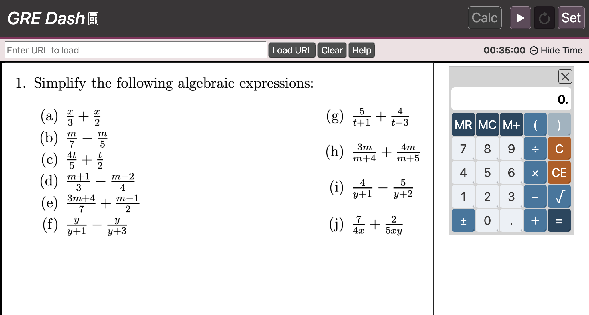

# GRE Dashboard
An emulation of the GRE calculator & timer.

Problem: The GRE PowerPreps are buried deep in the ETS website, requiring login and multiple steps to open, creating a barrier to quick practice. Furthermore, the GRE calculator is quite particular -- practicing with a phone calculator or other advanced calculators do not properly reflect the limitations imposed by the GRE calculator (max display is 8 characters, only 1 active parentheses set allowed, other quirks).

Solution: The GRE Dashboard, which allows for access to the GRE calculator and timer applets in one convenient place.

[Live Site](https://tylersernett.github.io/grecalc/)



## Built With
React ⬩ Bootstrap

## Features
* Realistic GRE-styled calculator which handles a number of quirks
  * Mouse and keyboard support
  * max-display: 8 characters
  * only 1 set of parentheses at a time
  * handles in-line order of operations (1 + 2 * 3 = 7)
  * Clear Entry button can clear numbers, but not operands
  * +/- button immediately after an operand will not work until a new number is entered
  * yields ERROR for
    * division by 0
    * negative square root
    * 8 character cap exceeded
* A countdown timer styled after the GRE timer

## Dev Notes
### Notes: Number Formatting:

```javascript
    const formatter = new Intl.NumberFormat('en-US', {
        maximumSignificantDigits: 8,
        maximumFractionDigits: 7,
    })
```
The above doesn't work because maximumFractionDigits overrides the maximumSignificantDigits -- so run it twice instead:

```javascript
    const format = (n) => {
        let num = new Intl.NumberFormat('en-US', {
            maximumSignificantDigits: 8
        }).format(n);

        num = new Intl.NumberFormat('en-US', {
            maximumFractionDigits: 7
        }).format(removeCommas(num));
        if (num == "-0") {
            return "0"
        }
        return num;
    }
```

### Notes: Drag and Drop
Issue: client can drag calculator all the way off screen
Solution: clamp the values to the visible area

```Javascript
const clamp = (num, min, max) => Math.min(Math.max(num, min), max);
let appWidth = document.getElementsByClassName('app-container')[0].offsetWidth;
let appHeight = document.getElementsByClassName('white-body')[0].scrollHeight
let calcElem = document.getElementById('calc-body'); 
let calcWidth = calcElem.offsetWidth; 
let calcHeight = calcElem.offsetHeight; 

let minWidth = -appWidth + calcWidth + 10;
let maxWidth = appWidth - coords.x - calcWidth;

//account for calc body top margin:
let marginString = getComputedStyle(calcElem).marginTop
let marginInt = parseInt(marginString); //crop the 'px' from the string & convert to integer
let bannersElem = document.getElementById('banners');
let minHeight = -(bannersElem.offsetHeight + marginInt); //-134
let maxHeight = appHeight - calcHeight - marginInt;

let xSum = position.x + MouseEvent.movementX;
let ySum = position.y + MouseEvent.movementY;
position.x = clamp(xSum, minWidth, maxWidth );
position.y = clamp(ySum, minHeight, maxHeight);

if (element) {
  element.style.transform = `translate(${position.x}px, ${position.y}px)`;
}
setPosition(position);
```

### Notes: useRef Best Practices
useRef: when you don't need to update the render. Allows one to avoid unnecessary re-renders.

### Notes: Input Limitations
Issue: timerInput can accept letters and non-digits, resulting in NaN display.
Solution: add attribute: {pattern="\d*"} to input tag.

### Notes: Styling
adjust vertical position:
    css: line-height

proper footer position:
https://stackoverflow.com/questions/90178/make-a-div-fill-the-height-of-the-remaining-screen-space
all the "top-level" tags must have height 100%
```css
html, body, #root { height: 100%}
```

Then set footer:
```css
footer {
  flex: 0 1 40px;
  text-align: center;
}
```
And content above footer should have: (you can use a spacer)
```css
.spacer{
  flex: 1 1 auto;
}
```

### Notes: Media query not working?
Make sure it's at the end of the css file!

### Notes: Overflow text not centering?
Use the following CSS:
```css
{
  display: flex;
  justify-content: center;
  align-items: center;
}
```

## Future Optimizations

1. Add login, allow users to save URLs / practice sets for quick access
2. Add skins for other tests (GMAT, SAT, ACT, TOEFL, etc)